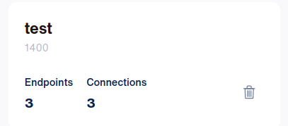

# cableman-lab
Repository that contains a simple laboratory for development and testing of cableman project

Install the base [ubuntu 20.04 vagrant box](https://github.com/rgl/ubuntu-vagrant).

## Initial configuration
On syntropy stack dashboard, create a network and save its id for further usage.



First visit the values.yaml files located inside the syntropy-agent folder and complete the configuration. More details about the configuration can be found at https://github.com/leogsilva/charts/tree/main/charts/syntropy-agent


## Launching
Launch the environment:

```bash
time vagrant up --provider=libvirt # or --provider=virtualbox
```

After the environment is up, the u1 host will be the broker cluster for the multi-cluster mesh
topology. If the broker is up and running, a file called ```broker-info.subm``` will be created inside folder /home/vagrant. Copy this file to the other hosts (u2 and u3) to the home folder of vagrant user

### Adding clusters to the mesh
Log to each other host (u2 and u3) 
```sh
vagrant ssh u2
```

and check if file ```broker-info.subm``` resides on /home/vagrant folder:

```sh
cd $PWD && ls -la broker-info.subm
```

On host u2, execute the following command to add the current kubernetes cluster to the mesh
```sh
subctl join broker-info.subm --cable-driver syntropy --repository docker.io/leogsilva --version dev --clusterid cluster2 --natt=false
```

The similar on host u3:
```sh
subctl join broker-info.subm --cable-driver syntropy --repository docker.io/leogsilva --version dev --clusterid cluster3 --natt=false
```
Important to note that we are using the syntropy driver to connect the kubernetes clusters to the mesh.

After some time, log to syntropy stack dashboard and you'll see an list of endpoints similar to the following image:


### Configuring the network
On syntropy stack dashboard, choose the previously created network and configure the three clusters in a single mesh topology:


### Exporting your first service 

First, ssh to host u2:
```sh
vagrant ssh u2
```
then become a root user:
```sh
sudo -s
```

Check if the submariner Gateway is up and running:
```sh
kubectl get Gateway -n submariner-operator
```
The output should be similar to:
```
NAME   HA STATUS
u2     active
```


Now deploy your first kubernetes service:
```sh

cd /home/vagrant
kubectl create namespace demo
kubectl create deployment nginx --image=nginx -n demo
kubectl expose deployment nginx --port=8080
./subctl export service --namespace demo nginx
```
Test if a serviceexport object was created:
```sh
kubectl get serviceexport nginx -n demo
```

and observe a similar output:
```sh
NAME    AGE
nginx   8d
```

Now we are able to export this service from cluster u2 to u3:


Now, ssh to host u3:
```sh
vagrant ssh u3
```
then become a root user:
```sh
sudo -s
```

Create a namespace to reference the exported service from cluster u2:
```
kubectl create ns demo
```

Execute a shell inside the kubernetes cluster:
```sh
kubectl -n default  run tmp-shell --rm -i --tty --image quay.io/submariner/nettest -- /bin/bash
```

Execute a curl to test the exported service. The output should be similar to:
```sh
bash-5.0# curl -v nginx.demo.svc.clusterset.local:8080
*   Trying 100.2.10.220:8080...
* Connected to nginx.demo.svc.clusterset.local (100.2.10.220) port 8080 (#0)
> GET / HTTP/1.1
> Host: nginx.demo.svc.clusterset.local:8080
> User-Agent: curl/7.69.1
> Accept: */*
> 
* Mark bundle as not supporting multiuse
< HTTP/1.1 200 OK
< Server: nginx/1.20.1
< Date: Sun, 20 Jun 2021 02:30:29 GMT
< Content-Type: text/html
< Content-Length: 612
< Last-Modified: Tue, 25 May 2021 13:41:16 GMT
< Connection: keep-alive
< ETag: "60acfe7c-264"
< Accept-Ranges: bytes
< 
<!DOCTYPE html>
<html>
<head>
<title>Welcome to nginx!</title>
<style>
    body {
        width: 35em;
        margin: 0 auto;
        font-family: Tahoma, Verdana, Arial, sans-serif;
    }
</style>
</head>
<body>
<h1>Welcome to nginx!</h1>
<p>If you see this page, the nginx web server is successfully installed and
working. Further configuration is required.</p>

<p>For online documentation and support please refer to
<a href="http://nginx.org/">nginx.org</a>.<br/>
Commercial support is available at
<a href="http://nginx.com/">nginx.com</a>.</p>

<p><em>Thank you for using nginx.</em></p>
</body>
</html>
* Connection #0 to host nginx.demo.svc.clusterset.local left intact
bash-5.0# curl nginx.demo.svc.clusterset.local:8080
<!DOCTYPE html>
<html>
<head>
<title>Welcome to nginx!</title>
<style>
    body {
        width: 35em;
        margin: 0 auto;
        font-family: Tahoma, Verdana, Arial, sans-serif;
    }
</style>
</head>
<body>
<h1>Welcome to nginx!</h1>
<p>If you see this page, the nginx web server is successfully installed and
working. Further configuration is required.</p>

<p>For online documentation and support please refer to
<a href="http://nginx.org/">nginx.org</a>.<br/>
Commercial support is available at
<a href="http://nginx.com/">nginx.com</a>.</p>

<p><em>Thank you for using nginx.</em></p>
</body>
</html>
```


## References

* https://www.wireguard.com/
* [wg-quick(8)](https://git.zx2c4.com/wireguard-tools/about/src/man/wg-quick.8)
* https://wiki.archlinux.org/index.php/WireGuard
* https://wiki.debian.org/Wireguard
